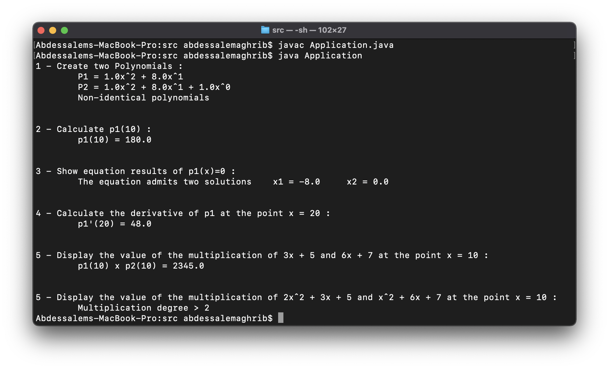

# Polynomial

## Description

\
This OOP-based project proposes the management of [Polynomials](https://en.wikipedia.org/wiki/Polynomial). It offers the following features :

- Create polynomials.
- Display Polynomials.
- Evaluate Polynomials.
- Solve a second degree equation.
- Multiply polynomials.
- Derive polynomials.
- Check the equality of two Polinomials.

\
<spcace>

## Tools used

\
<spcace>

| Tool | Version |
| ----------- | ----------- |
| Machine | MacBook Pro 2,3 GHz Dual-Core Intel Core i5 - 8 GB 2133 MHz LPDDR3 |
| Operating system | macOS Big Sur 11.5.2 |
| JAVA | version [1.8.0_301](https://www.java.com/en/download/manual.jsp) |

\
<spcace>

## Execution

\
<spcace>

- Take as an example two polynomials :

> P1 = x<sup>2</sup> + 8x

> P2 = x<sup>2</sup> + 8x + 1

- To compile code :

```sh
cd <project_path>
javac Application.java
```

- To execute code :

```sh
java Application
```

- Results :

